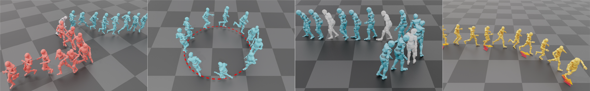

# <p align="center"> Interactive Character Control with Auto-Regressive Motion Diffusion Models </p>
### <p align="center"> [Yi Shi](https://github.com/Yi-Shi94/), [Jingbo Wang](https://wangjingbo1219.github.io/), [Xuekun Jiang](), [Bingkun Lin](), [Bo Dai](https://daibo.info/), [Xue Bin Peng](https://xbpeng.github.io/) </p>
<p align="center">
  
</p>

## Links
[page](https://yi-shi94.github.io/amdm_page/) | [paper](https://arxiv.org/html/2306.00416v2) | [video](https://www.youtube.com/watch?v=5WE9hy0xCI4&ab_channel=YISHI) | [poster]() | [slides](https://docs.google.com/presentation/d/1kA_LT9zi4nb7FbJjZGD_g692NfGSKbfXBuVEQxUEXAg/edit?usp=sharing)

## Implementation of Auto-regressive Motion Diffusion Model (A-MDM)
We developed a PyTorch framework for kinematic-based auto-regressive motion generation models, supporting both training and inference. Our framework also includes implementations for real-time inpainting and reinforcement learning-based interactive control. If you have any questions about A-MDM, please feel free to reach out via ISSUE or email.

## Dataset Preparation
### LaFAN1:
[Download](https://github.com/ubisoft/ubisoft-laforge-animation-dataset) and extract under ```./data/``` directory.
BEWARE: We didn't include files with a prefix of 'obstacle' in our experiments. 

### 100STYLE:
[Download](https://www.ianxmason.com/100style/) and extract under ```./data/``` directory.

### Any other BVH dataset:
Download and extract under ```./data/``` directory. Create a yaml config file in ```./config/model/```, 

### AMASS:
Follow the procedure described in the repo of [HuMoR](https://github.com/davrempe/humor)

### HumanML3D:
Follow the procedure described in the repo of [HumanML3D](https://github.com/EricGuo5513/HumanML3D.git) 


### Sanity Check:
Specify your model config file in 
```
python run_sanity_data.py
```

## Base Model
### Training

```
python run_base.py --arg_file args/amdm_DATASET_train.txt
```
or
```
python run_base.py
--model_config config/model/amdm_lafan1.yaml
--log_file output/base/amdm_lafan1/log.txt

--int_output_dir output/base/amdm_lafan1/
--out_model_file output/base/amdm_lafan1/model_param.pth

--mode train
--master_port 0
--rand_seed 122
```
Training time visualization is saved in --int_output_dir


### Inference
```
python run_env.py --arg_file args/RP_amdm_DATASET.txt
```

#### Inpainting
```
python run_env.py --arg_file args/PI_amdm_DATASET.txt
```

### High-Level Controller


#### Training
```
python run_env.py --arg_file args/ENV_train_amdm_DATASET.txt
```
#### Inference
```
python run_env.py --arg_file args/ENV_test_amdm_DATASET.txt
```

### Installation
```
conda create -n amdm python=3.7
pip install -r requirement.txt
```

### Update
1. July 28 2024, framework released, supported LAFAN1
2. upcoming, checkpoint upload and support for more dataset

## Acknowledgement
Part of the RL modules utilized in our framework are based on the existing codebase of [MotionVAE](https://github.com/electronicarts/character-motion-vaes), please cite their work if you find using RL to guide autoregressive motion generative models helpful to your research.

## BibTex
```
@article{
        shi2024amdm,
        author = {Shi, Yi and Wang, Jingbo and Jiang, Xuekun and Lin, Bingkun and Dai, Bo and Peng, Xue Bin},
        title = {Interactive Character Control with Auto-Regressive Motion Diffusion Models},
        year = {2024},
        issue_date = {August 2024},
        publisher = {Association for Computing Machinery},
        address = {New York, NY, USA},
        volume = {43},
        journal = {ACM Trans. Graph.},
        month = {jul},
        keywords = {motion synthesis, diffusion model, reinforcement learning}
      }
```
